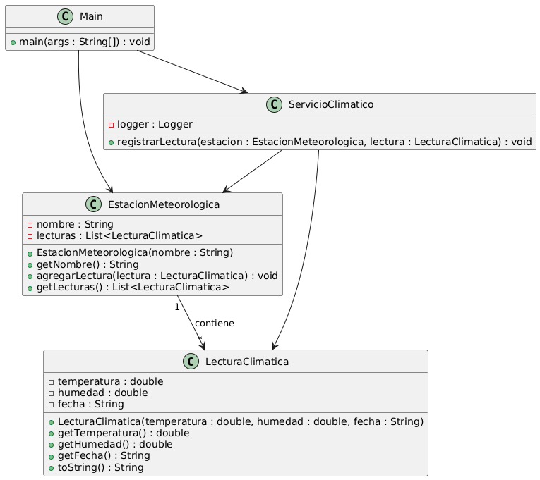

# 🌦️ Ejercicio de Programación Orientada a Objetos: Estación Meteorológica con Logs y Manejo de Errores

## Enunciado del ejercicio

Diseña un sistema orientado a objetos en Java que modele una **Estación Meteorológica** encargada de registrar lecturas climáticas. Este sistema debe incorporar un manejo robusto de errores utilizando **Log4j 2**, registrar logs con distintos niveles de severidad y dividir los mensajes en archivos de log diferenciados.


###  Requisitos del sistema

1. **Clases principales**:
   - `LecturaClimatica`: contiene información como temperatura, humedad y fecha.
   - `EstacionMeteorologica`: almacena un conjunto de lecturas y su nombre.
   - `ServicioClimatico`: encargado de registrar nuevas lecturas y validar sus valores.

2. **Validaciones**:
   - La temperatura debe estar entre -90°C y 60°C.
   - La humedad debe estar entre 0% y 100%.
   - Cualquier lectura fuera de estos rangos debe generar una excepción y registrarse como error grave.

3. **Logging**:
   - Se utilizará `Log4j 2`.
   - Los mensajes de nivel `INFO` y `WARN` se escribirán en un archivo `logs/aplicacion.log`.
   - Los mensajes de nivel `ERROR` y `FATAL` se escribirán en un archivo `logs/errores.log`.
   - También se visualizarán todos los mensajes en consola.

4. **Pruebas unitarias**:
   - Implementa pruebas para verificar la validación de lecturas y el correcto registro de logs.

5. **Formato de logs**:
   - Usa patrones de formato para mostrar la fecha, hilo, nivel, clase y mensaje.

---

##  Pruebas Unitarias Detalladas

Se espera que el sistema incluya una clase de pruebas unitarias con al menos los siguientes casos:

1. **Prueba de lectura válida**  
   - Temperatura: 25°C, Humedad: 70%.  
   - Verifica que se agrega correctamente a la estación sin errores ni excepciones.

2. **Prueba de temperatura inválida**  
   - Temperatura: -100°C, Humedad: 50%.  
   - Verifica que lanza una excepción y se genera un log de error.

3. **Prueba de humedad inválida**  
   - Temperatura: 20°C, Humedad: 150%.  
   - Verifica que lanza una excepción y se genera un log de error.

4. **Prueba de acumulación de lecturas**  
   - Se agregan múltiples lecturas válidas.  
   - Verifica que el tamaño de la lista de lecturas de la estación sea correcto.

5. **Prueba de logging**  
   - Simula una lectura inválida.  
   - Verifica que el mensaje de error aparezca en el archivo `errores.log`.

---

## Diagrama de Clases



---

## Dependencias requeridas

Este proyecto requiere Log4j 2. Asegúrate de incluir las siguientes dependencias en tu archivo `pom.xml` si estás utilizando Maven:

```xml
<dependency>
    <groupId>org.apache.logging.log4j</groupId>
    <artifactId>log4j-core</artifactId>
    <version>2.20.0</version>
</dependency>
<dependency>
    <groupId>org.apache.logging.log4j</groupId>
    <artifactId>log4j-api</artifactId>
    <version>2.20.0</version>
</dependency>
 <dependency>
   <groupId>org.junit.jupiter</groupId>
   <artifactId>junit-jupiter</artifactId>
   <version>5.10.0</version>
   <scope>test</scope>
</dependency>
```

---

## Evaluación sugerida

- Correcta aplicación de la POO.
- Manejo adecuado de errores y excepciones.
- Uso correcto y configuración funcional de Log4j 2.
- Pruebas unitarias que cubran casos válidos e inválidos.
- Documentación clara del código.
